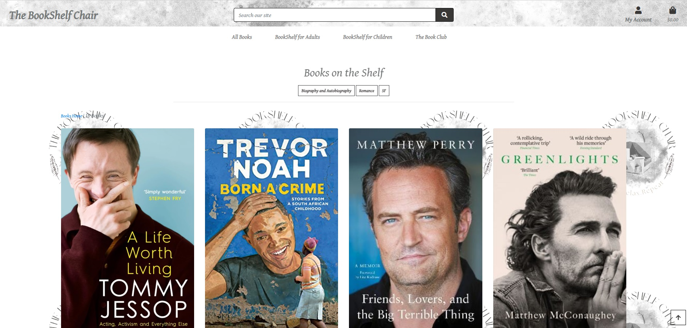

<h1>The BookShelf Chair</h1>
 
 
The BookShelf Chair is an online book store which also provides a book club to discuss and interact with other readers 
Users can purchase books or leave a comment for a book  
They can create an account to keep track of their orders and they can also subscribe to a mailing list. 
 

 
 
<h2>User stories</h2>
The project has started by establishing the user stories based on the template: As a "site user" I can "action" so that "reward" 
The steps followed to create the user stories in Github can be seen below: 
1. In the project repository, from the main menu, select Issues 
2. Select New Issue from the right-hand side and add a title, starting with USER Stories. 
3. Add a description in the Description box, based on the template above. 
4. Submit the new issue.
 

 
There are a total of 21 User Stories for this project, as listed below: 
- View list of products 
- View individual product details 
- Add comment to Book Club Page 
- Add New topic to Book Club page 
- Register for an account 
- Login/Logout page 
- Article/post view 
- Email confirmation after registering 
- Change password 
- Sort list of products 
- Sort products by category 
- Search by name or description 
- Add product in shopping bag 
- See total of bag content 
- See subtotal after each purchase 
- Pay securely 
- Add new products as a site owner 
- Edit products as a site owner 
- Delete products as a site owner 
 
 
<h2>Features</h2>

<h3>Existing Features</h3>
 
Creating an admin in Django to manage the page 

 
Creating a product page with all categories available, with filter option to sort them. 
 

 
Creating a Book Club page to share comments and join conversations. Each topic has a link field to add the link to a certain book from the store 
 
 

 
A My account page to login/register and see the history og a sale and delivery details. 
 

 
 
<h2>Marketing strategies</h2>
 
- Social media Marketing:
 

 
- using the Facebook page to create engagement, sharing daily posts, for a consistent online presence,  
with content like: new book releases, news about authors, creating polls and competitions, promoting the Book Club, a great feature for the website. 
 
- Email Marketing:
 

 
- with the Mailchimp subscribe form embedded in the website for users, several emails campagnes can be launched 
 
-  a monthly email with details about the book of the month  
 
- Special offers for subscribers: 15% off to certain categories from the website only for subscribers 
 
- Invitation to join the discussions in the book club for old customers 
 
<h3>Features left to implement</h3>
- Admin to approve comments and topics before they are published 
- Option to delete a comment for users 
 
<h2>Fixed Bugs</h2>
 
- NameError: name 'book_club' is not defined. Fix: urls path for book_club didn't include views. before book_club 
 
- WARNINGS:
?: (urls.W005) URL namespace 'admin' isn't unique. You may not be able to reverse all URLs in this namespace. Fix: remove the admin path from book_club urls.py  
 
- Subject.html page not working. Fix: The file subject.html had a space before the name which was causing the error 
 

 
- Get_object_or404 not defined. Fix: get_object_or404 was not imported in bag/views.py 
 

 
- TempleDoesNotExist. Fix: Folder name missing an s. 
 
 

 
<h3>Testing</h3> 
 
<h2>Manual testing of each section of the site</h2>
- Admin: 
 
The admin can log through the admin pannel on https://thebookshelfchair-c10ecc9e636c.herokuapp.com/admin where they have access to the control pannel. 
 
The admin can add and delete books and categorise, approve users and create topics for the Book Club. 
 

 
On the interface, the admin can edit books, delete them or add new ones. 
 
 
 
 
- User 
The User can create an account or login to an existing one. 
 
 
When a new user is creating an account, he is promoted to add his email address and create a password. 
 
 
A confirmation email it is sent to the user. This section was tested with a temporary generated email, as per below. 
 
 
 
 
  A verification email is sent to the new user, with a link which brings the user back to the bookstore's page. 
Once the email is confirmed, the user can start their shopping. 
Note that the user can add to bag without being login as well. But they can create an account or login to keep their order history 
 
 
 
The user can browse the store, check out the categories and read descriptions of the books by opening them. 
The user can also update quantity when adding to bag a certain product 
 
 
A message pops up in the right corner every time a new product is added to the shopping bag. 
 
The user can then edit their bag by clicking on the blue bag icon from the top right. 
There they can delete products or adjust quantity. 
 
 
The user can subscribe to the mailing list to keep in touch with offers and latest news about published books. 
A confirmation message about their subscription will be promted after they enter their email. 
 
In case the email is already subscribed, the message to confirm that also shows up. 
 
 
The user can also navigate to the Book Club where he can join a topic already in debate. 
Their comment is automatically added to that specific topic. 
 
 
 
A link to the book in discussion is added to transfer the user to the product, in case he would like to read more or purchase it. 
 
When the user checkout, a confirmation email is sent to his email address. 
 
 

<h2>Data Model</h2>
 
The code has models, templates and views, working on the Django framework. 
There is a base.html to include the navigation bar and the footer, which is then extended in each other html files. 
Including a superuser to control the admin panel, the front end has an interactive interface for users to purchase products, leave comments and create topics. 
Automatic messages are poping to the side of the screen for each action regarding the shopping bag. 
The workspace was deployed to Heroku aat the end. 
 
<h3>Validator testing</h3>
 
-No errors were returned when passing through the PEP8 Linter - https://pep8ci.herokuapp.com/, only spaces and lines too long 
 

 
- No errors were returned when passing through https://jigsaw.w3.org/css-validator/  
 

 
 <h2>Deployment</h2>
 
- This project had an initial deployment at the beginning to Heroku
 
A. Create a new Heroku app:
- Log to Heroku 
- On Dashboard, click on New and Create New App 
- Add a name to your new app and click create app 
 
B. Create a database on ElephantSQL.com 
- Create an account and create a new instance. 
-Select the free Tiny Turtle Plan and select a region. 
- Once the instance is created, copy the URL for the database 
 
C. Create Heroku Vars
 
- From Settings, Show Config Vars and add the data base URL, the secret key 
-Add the AWS keys, the database URL, stripe keys, email config  
 
D. Link the Heroku app to the repository 
- Go to Deploy Tab 
- Select Github for Deployment method 
- Search for your blog repo  
- Select Main as deployed branch and press deploy. 
- A new app link will be created.  
 
The depolyed project can be found here: https://thebookshelfchair-c10ecc9e636c.herokuapp.com/
 
<h2>Credits</h2>
 
- Stack Overflow 
- Bootique Ado walkthrough projects from Code Institute 
-  